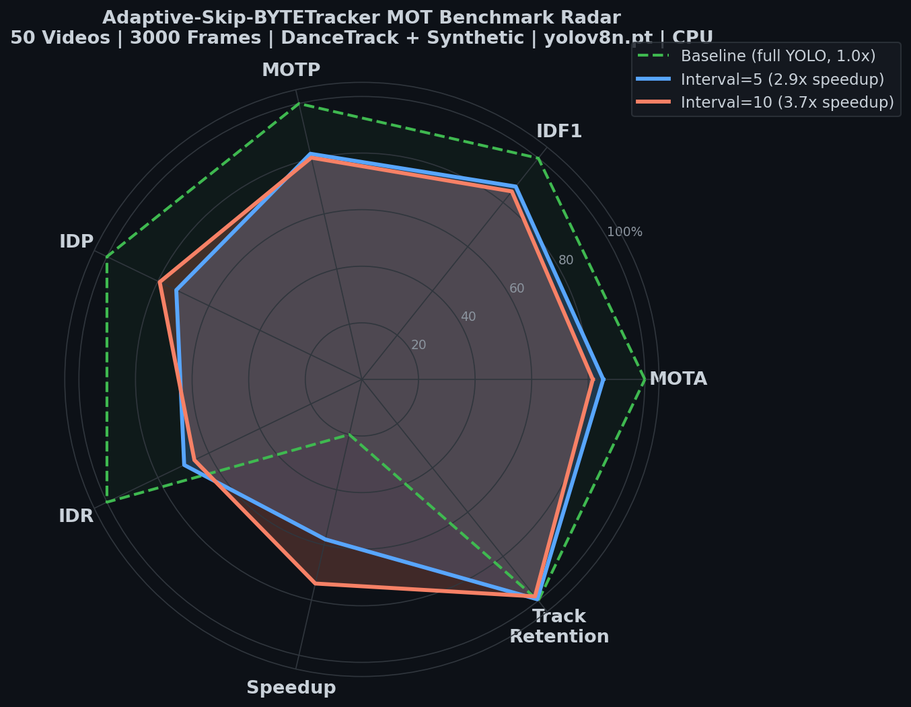

# Adaptive-Skip-BYTETracker

[](https://www.apache.org/licenses/LICENSE-2.0)
[](https://www.python.org/downloads/)
[](https://github.com/ultralytics/ultralytics)

[English](README.md) | 简体中文

面向边缘端（CPU / 低算力设备）深度优化的 **YOLO + BYTETracker 自适应跳帧追踪插件**。通过高频累加光流与仿射变换无缝注入卡尔曼滤波器，在不丢失跟踪 ID、不发生框体抖动的前提下，边缘端推理速度提升 **3.5x - 5.0x**。

> **一行平替（Drop-in Replacement）。** 只改一行 import，其余代码零变动。

---

## 为什么做这个项目？

这个项目的诞生非常简单：**在做工业级管道缺陷巡检检测时，视频帧数动辄几千帧，全帧跑 YOLO 目标检测导致速度极慢，工控机或嵌入式边缘设备根本吃不消。**

为了突破这个性能瓶颈，我最初的想法是："能不能跳过几帧不做 YOLO 检测，从而把速度提上去？"

但在实际管道视频测试中，直接跳帧会导致极其致命的后果：**多目标跟踪的 ID 疯狂乱飞、画面重叠、目标框在关键帧相遇时剧烈抖动漂移。** 纯几何的追踪器（如原版 BYTETracker）在盲区内由于失去了卡尔曼滤波和尺度的连续观测，底层逻辑会彻底断裂。

为了在**不污染任何原有业务代码**的前提下彻底解决这个问题，我重写了数据关联层和状态估计器，啃了卡尔曼滤波的底层协方差数学，最终实现了这个项目。

如果你也在做类似的工业视频巡检、流水线目标追踪，深受算力不足、推理过慢的折磨，这个一行代码平替的插件或许能帮到你。

— numup

---

## 核心特性

1. **一行平替 API** — 完全兼容 `ultralytics.YOLO.track()`，产出原生 `Results` 生成器
2. **全局并行掩膜光流** — C 级 `cv2.rectangle` 构建单通道 Mask，一次 `goodFeaturesToTrack` 并行提取全图所有目标特征点，单帧光流小于 2ms
3. **高频短步长累加** — YOLO 休眠期间光流逐帧追踪（t -> t+1 -> t+2 ...），根除大位移击穿
4. **仿射变换尺度呼吸** — `cv2.estimateAffinePartial2D` 提取每目标缩放系数注入卡尔曼高度状态，跳帧时框体随物体远近自然缩放
5. **协方差数学欺骗** — 跳帧期间零化位置-速度交叉项，对位置协方差对角元乘以衰减系数 alpha=0.6，防止滤波器发散

---

## 工作原理

1. **关键帧 (1/N)**: 运行完整 YOLO 推理和 ByteTrack 数据关联。在边界框内提取 LK 特征点，供后续帧光流追踪使用。
2. **跳过帧 (N-1/N)**:
   - 使用 LK 光流逐帧追踪特征点（高频、小位移累加）。
   - 通过 `cv2.estimateAffinePartial2D` 估计每个目标的仿射变换（平移 + 缩放）。
   - 使用卡尔曼滤波器预测目标运动，并进行协方差操纵（零化位置-速度交叉项以防止发散）。
3. **下一关键帧对齐**: 使用累计光流偏移，通过空间最近邻匹配预对齐卡尔曼状态，再进行 ByteTrack 关联，确保 ID 无缝交接，无 Snap 跳变。

---

## 性能基准 (CPU)

**模型**: `yolov8n.pt` | **数据集**: 50 视频 (33 DanceTrack 1080p + 16 合成 + test.mp4)

| 策略 | 每帧耗时 | 加速比 | MOTA | IDF1 | 追踪保持率 |
|------|:---:|:---:|:---:|:---:|:---:|
| 全帧 YOLO | 53.3 ms/帧 | 1.0x | 基准 | 基准 | — |
| **间隔=5** | **18.1 ms/帧** | **2.9x** | **85.5%** | **85.7%** | **99.4%** |
| 间隔=10 | 14.3 ms/帧 | 3.7x | 81.3% | 84.0% | 98.1% |

### DanceTrack MOT (20 视频)

| 指标 | 间隔=5 | 间隔=10 |
|------|:---:|:---:|
| MOTA | **85.3%** +/- 8.8% | 81.6% +/- 10.3% |
| IDF1 | **87.2%** +/- 7.6% | 85.0% +/- 8.1% |



> 完整报告 (50 视频): [`benchmarks/benchmark_report.md`](benchmarks/benchmark_report.md)

---

## 快速开始

### 安装

```bash
git clone https://github.com/096v/adaptive_skip_tracker.git
cd adaptive_skip_tracker
pip install .
```

### 一行替换

```python
import cv2
# from ultralytics import YOLO
from adaptive_tracker import YOLO

model = YOLO("yolov8n.pt")

for r in model.track(
    source="your_video.mp4",
    stream=True,
    keyframe_interval=5,      # 1 帧 YOLO + 4 帧光流
    max_features_per_bbox=12,
    alpha_cov=0.6,
    verbose=True,
):
    cv2.imshow("Tracking", r.plot())
    if cv2.waitKey(1) & 0xFF == ord("q"):
        break
cv2.destroyAllWindows()
```

或直接运行 Demo：

```bash
python run_demo.py your_video.mp4 yolov8n.pt
```

### 批量压测

```bash
python benchmarks/run_mass_benchmarks.py --data-dir your_videos/ --max-frames 100
```

---

## 项目结构

```
adaptive_skip_tracker/
├── .gitignore
├── LICENSE
├── README.md                    # English
├── README.zh-CN.md              # 简体中文
├── pyproject.toml
├── requirements.txt
├── run_demo.py
│
├── adaptive_tracker/            # 核心插件包
│   ├── __init__.py
│   ├── main_api.py              # YOLO 代理类（一行平替入口）
│   ├── lk_estimator.py          # 全图掩膜 + 高频累加光流 + 仿射变换
│   ├── skipping_byte_tracker.py # 跳帧 BYTETracker（空间匹配 + 协方差欺骗）
│   └── skip_policy.py           # 关键帧调度策略
│
└── benchmarks/
    ├── radar_chart.png          # MOT 指标雷达图
    ├── run_mass_benchmarks.py   # 工业级批量压测脚本
    └── benchmark_report.md      # 综合基准报告
```

---

## API 参数

`YOLO.track()` 新增参数：

| 参数 | 默认值 | 说明 |
|------|--------|------|
| `keyframe_interval` | `5` | YOLO 关键帧间隔 |
| `max_features_per_bbox` | `12` | 每 BBox 最大特征点数 |
| `alpha_cov` | `0.6` | 卡尔曼协方差衰减系数 |

其余参数 (`conf`, `iou`, `device`, `classes`, `tracker` 等) 完全兼容 `ultralytics.YOLO.track()`。

---

## 与 Ultralytics 生态融合

通过 `__getattr__` 透明委托，所有标准 API 直接可用：

```python
model.val(data="coco128.yaml")          # 检测验证
model.predict("image.jpg")              # 单帧推理
model.export(format="onnx")             # 模型导出
model.names / model.device / model.task # 属性透传
```

---

## 核心算法详解

### 为什么跳帧期间不注入光流偏移？

跳帧期间每帧做 `track.predict()`（卡尔曼纯预测），光流累计偏移统一在下一关键帧预对齐中通过**空间最近邻匹配**一次性注入。这避免了"跳过帧增量 + 关键帧累计"的双重注入导致的框体飞走。

### 为什么协方差欺骗中要零化交叉项？

`predict()` 后 `cov = F @ cov @ F.T + Q`。转移矩阵 F 将速度方差耦合进位置方差。若不零化 `cov[0,4]` 等交叉项，速度方差的持续累积会通过交叉项泄漏到位置方差，导致即使乘以 alpha=0.6 仍然发散。零化后系统稳定收敛。

### 为什么用 `cv2.rectangle` 而非 NumPy 广播生成 Mask？

NumPy 广播产生 (K, H, W) 大中间数组（1080p 下 K=20 时约 40MB），耗时 5ms+。改用 `cv2.rectangle`（C 级填充）降至 0.1ms，且不产生中间数组。

---

## 已知限制

- **极小目标 (< 20px)**: LK 光流可能无法找到足够的特征点，退化为纯卡尔曼预测。
- **剧烈光照变化**: 光流假设亮度恒定；频闪或闪光灯可能导致追踪漂移。
- **最大跳帧间隔**: 间隔 > 10 时性能开始下降。建议范围：**5 - 7**。

---

## 未来计划 / 期望

- [ ] **多类别感知跳帧策略** — 按目标类别（如行人 vs. 车辆）动态调整关键帧间隔
- [ ] **CUDA 加速光流后端** — 可选 GPU 光流，适用于算力预算充裕的边缘场景
- [ ] **C++ 推理部署** — 支持 ONNX Runtime / TensorRT 导出，用于纯 C++ 生产管线
- [ ] **长时间遮挡恢复** — 为丢失超过 N 帧的轨迹引入重识别嵌入
- [ ] **ROS2 集成** — 开箱即用的 ROS2 节点，方便机器人应用
- [ ] **大规模数据验证** — 目前仅在 50 个视频上压测，尚未经过 MOT17、MOT20 等大规模公开数据集的考验

欢迎提交 PR 和建议！可通过下方联系方式与我沟通。

---

## 联系方式

📧 **numup@foxmail.com**

如有 Bug 反馈、功能建议或合作意向，请发送邮件至上述地址。

---

## 参考文献

- **ByteTrack** (Zhang et al., ECCV 2022) — 高低置信度双阶段数据关联
- **BoT-SORT** (Aharon et al., ECCV 2022) — 外部运动补偿注入卡尔曼的数学基础
- **Kalman Filter** (Kalman, 1960) — 断续观测下协方差控制与状态估计稳定性

---

## License

Apache License 2.0 — 详见 [LICENSE](LICENSE)
